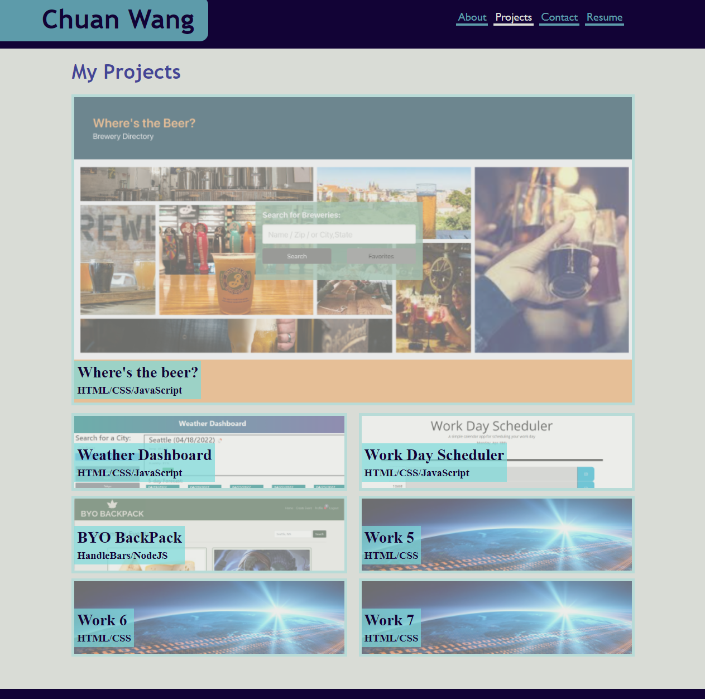
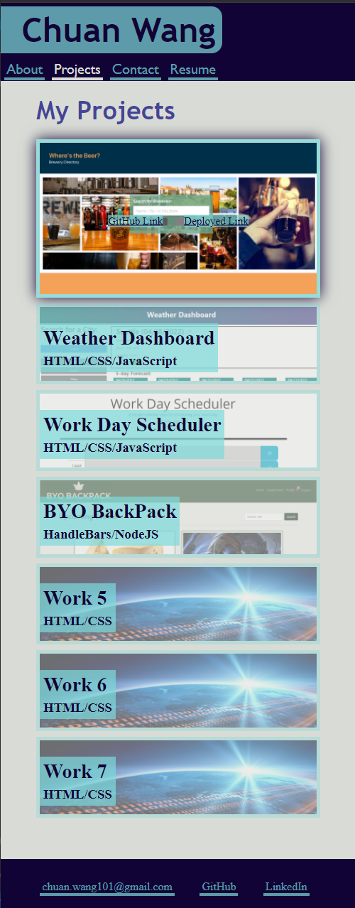

# react-portfolio
# Chuan Wang

My portfolio site rebuilt with react  
Responsive design  
Links for my work will show up on hover  
Contact form displays messages upon mouse leaving field if no entry  
In case of email uses regex to check for valid email upon mouse leaving field  
Contact form currently do not send actual email to me, my email is on the footer

## Deployed Link
https://chuanw101.github.io/portfolio-site/

## Screen shots
### Regular view

### Mobile view
